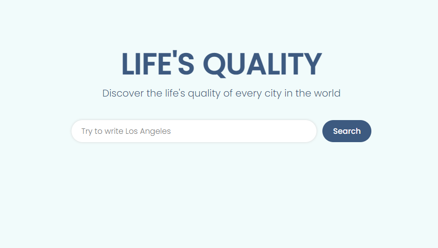

# Advanced Javascript Project

## Description

In this little project i used an API to get data of the life's quality of the most famous cities of the world.

Here you can find a lot of categories and their scores, a description of the city and a total score. 

## What i used to create it

- HTML
- CSS
- JAVASCRIPT
- AXIOS
- LODASH

## Where to try it

To try this website follow the link below!

https://advancedjs-project.netlify.app/

Thanks for your attention! 